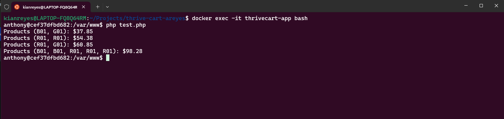
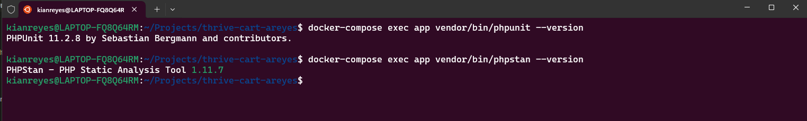
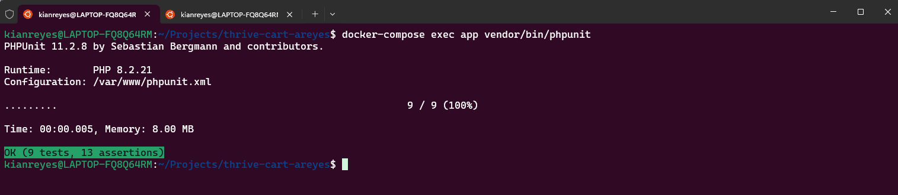
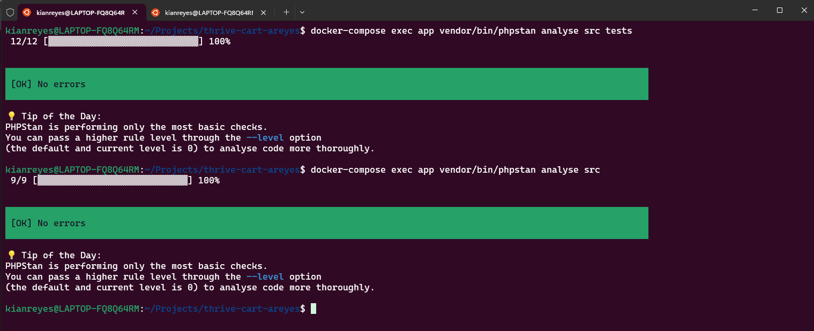

# **Thrive Cart Exam**

## **Acme Widget Co - Sales System**

## **Introduction**

Acme Widget Co are the leading provider of made up widgets and they’ve contracted you to
create a proof of concept for their new sales system.

## **Pre-requisites**
1. Docker
2. GIT

## **Installation**

To install Project Title, follow these steps:

1. Clone the repository: **`git clone https://github.com/anthnyrys-dev/thrive-cart-areyes.git`**
2. Navigate to the project directory: **`cd thrive-cart-areyes`**
4. Build the project: **`docker-compose build app`**
5. Run the environment in background mode: **`docker-compose up -d`**
4. Remove composer.lock: **`docker-compose exec app rm -rf vendor composer.lock`**
6. Run composer install **`docker-compose exec app composer install`**
7. Go inside to the container **`docker exec -it thrivecart-app bash`**

## **Shell Commands**
1. **`docker-compose exec app vendor/bin/phpunit`**
2. **`docker-compose exec app vendor/bin/phpstan analyse src`**
3. **`docker-compose exec app vendor/bin/phpstan analyse src tests`**
4. **`docker-compose exec app vendor/bin/phpunit --version`**
5. **`docker-compose exec app vendor/bin/phpstan --version`**

## **Screenshots**
### Run test.php script

### Dependencies

### Unit tests

### Phpstan
